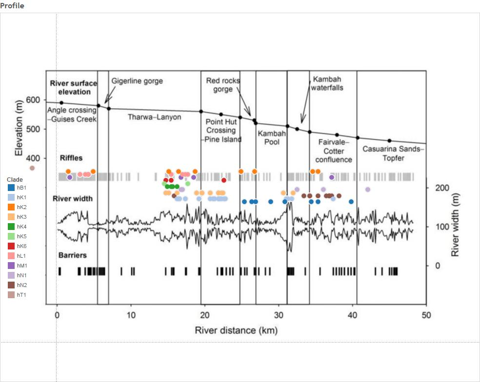

---
title: "Upper Murrumbidgee Larval Cod Dispersal Analysis"
author: "Alan Couch"
date: "`r format(Sys.time(), '%a %b %d %X %Y')`"
output: word_document
---


```{r, "Project_Template_and_Knitr", echo=FALSE, warning=FALSE}
#The following 2 and 4 lines are needed if knitr is to work with ProjectTemplate.
require(knitr)
if (basename(getwd()) == "src") setwd("..") #needed to get knitr to work with project template
library('ProjectTemplate') #All projectTemplates need this up front
load.project() #All projectTemplates need this up front
```

```{r "Set_Global_Options", echo=FALSE, warning=FALSE}
options(width=200)
opts_chunk$set(echo=FALSE, warning=FALSE, message=FALSE)

knitr::opts_chunk$set(fig.width=15, fig.height=15,fig.path="../graphs/") #Make Figures larger and save them
```
This document maps out the analysis of the dispersal of Murray cod larvae in the Murriumbidgee river. It includes sampling, larval morphological characteristics, genome profile and a natural biogeochemical markers. First the relevant r libraries are loaded 

```{r "LoadLibraries", echo=TRUE}
source("http://addictedtor.free.fr/packages/A2R/lastVersion/R/code.R")# load code of A2R function
library(ggplot2)
library(ggdendro)
library(ape)
library(dendextend)
library(Hmisc)
library(ade4)
```
 The larvae used in the dispersal analysis were collected in 2013 from 6 sites.


###Calculate Some Additional Parameters

This section is to add some calculated variables to the data. In particular to add:
 
  Age from Otolith Length: 74.308*[MeanOtolithLength]-4.44361 (Days)
  
  Hatch date:  [Day of Year Caught]-[Age From Otolith Length] (Day of the Year - DoY)
  
  Incubation: 20.67-0.667*[WaterTemp(DegC) Mean] (Days)
  
  Spawning:[Hatch]-[Incubation] (Day of the Year)

These additional parameters will be used to estimate distances that the larvae have dispersed based on the number of days available to them since leaving the nest and the day and location of collection. In turn the time available will be used to model the most likely distance travelled by the larvae.

```{r "Additional_Calculations", echo="TRUE"}

larv$ageOL<-74.308*larv$Mean.Otolith.Length.is.in.Millimetres.for.comparison.with.Adults-4.44361
larv$hatchdoy<-larv$Day.of.Year-larv$ageOL
larv$incTime<-20.67-0.667*larv$WaterTemp.DegC..Mean
larv$spawn<-larv$hatchdoy-larv$incTime

larv[c(20:30),c(119:122)] #just to see all OK
```

But before that we need to establish individual larval genetic identies so that we can see if genetic distance is positively corelated with geographic distance between individuals.


###All Maccullochella Larvae

A dendrogram of all the larvae allows examination of the relationships between all the larvae. In the first instance this is neccessry to ensure there are no species other than Murray cod in the subsequent analysis.

```{r "All_Maccullochella_Larvae", echo=TRUE}

MacDm <- dist(allsnps) #Create a distance matrix for all Maccullochella larvae

heatmap(as.matrix(MacDm)) #Make a heat map

MacHC <- hclust(MacDm) #make a heirarchical cluster

plot(color_labels(MacHC, k = 5), main="All Maccullochella Larvae") #Plot the cluster dendrogram
```

All the larvae collected fall into one of four distinct clades. The above dendrograms shows Murray cod and two known Trout cod controls, and what appears to be F1 and F2 hybrids between the two species. There were 4 hybrid and no pure trout cod larvae detected in the 92 larvae caught and sequenced from the river. 

It will be interesting to mito-sequence the trout cod and determine the species of the male and female parent. It is likely that that the female is the Trout cod in the mating pair given the scarcity of trout cod compared with Murray cod and the mate pressure that must exist. 

So we now use the set with the non-Murray cod removed to identify Murray cod clades and conduct the remainder of the analysis on the Upper Murrumbidgee Murray cod larvae only.  The Trout cod and the hybrids are easily identified and eliminated from the data to ensure we are looking only at the Murray cod larvae.

###Murray Cod Larvae

First we look at a heat map and dendrogram of Murray cod larvae having excluded Trout cod and hybrids data from the dat frame. 
```{r, "Murray_Cod_Larvae_Only", echo=TRUE}
MCdm <- dist(MCsnps)#Create a Murray Cod Only distance matrix

heatmap(as.matrix(MCdm), main="Murray Cod Heat Map")#Heat map

MChc <- hclust(MCdm) #Clutser
#Plot it
plot(MChc,main="Maccullochella peelii Larvae")
```

In most cases very closely related larvae have been collected at the same spot over the same period of a few of days. But in some cases very closely related pairs of larvae have turned up at different sites. Sometimes over time frames that seem unlikely or suggest the larvae have travelled upstream. However, must remember that it is siblings - not the same fish - that is caught so this might just represent the 'smear' of larvae along the river after dispersing from the nest.

The distance matrix suggests a very low genetic diversity in the population of Murray cod sampled with most of the distances around 0.03. Given this, can we be sure that the most closely related larvae are siblings? 

```{r, "A2R_Dendrogram"}

#Colour Dendrogram
#A2Rplot(MChc, k = 12, boxes = FALSE, col.up = "gray50")
dend1 <- color_labels(MChc, k = 12)#Use h or k
plot(dend1, main="Maccullochella peelii Larvae")
```

The Murray cod larvae can now be resolved into 12 clades.
```{r, "ExtractClades", echo=TRUE}

cladeNo<-cutree(dend1,k=12) #This is like using:dendextend:::cutree.dendrogram(dend1,h=70) h or k can be specified
cladeNo<-as.data.frame(cladeNo)
#For example:
cladeNo[c(20:30),] #The clades are numbered by default. So I need to name them something sensible for subsequent analysis.

```

###Trout Cod Larvae

Although Trout cod and hybrid data are excluded from further analysis, the heatmap and dendrogram are provided here for completness. In any case it is not an insignificant finding that the two species do in fact hybridise in this natural riverine environment even though hybrids have been seen in hatcheries and impoundments previoulsy. Furthermore this is the first time fertile F1 have been recorded as evidenced by the finding of an F2 hybrid. That said there is some question as to the providence of the Trout cod in this case as they were believe extirpated and restocked too recently (2006?) for 2 generations to have occured. FACT check this.
```{r, "Trout_Cod_Dendrograms", echo=TRUE}
#A heatmap and dendrogram for Trout Cod shows three distinct clades.
TCdm <- dist(TCsnps)
#Heat map
dataMatrix <- as.matrix(TCdm)
heatmap(dataMatrix, main="Trout Cod Heat Map")
#cluster
TChc <- hclust(TCdm)
#Plot it
#plot(TChc, main="Maccullochella macquariensis larvae")
A2Rplot(TChc, k =3, boxes = FALSE, col.up = "gray50",main = "Maccullochella macquariensis larvae")

```
Both the heatmap and dendrogram for Trout Cod shows three distinct clades.

##Upper Murrumbidgee Larval Murray Cod Genetic and Geographic Distances

This test corelates the physical distances of the nests of the larvae with genetic distance of larvae from the Murrumbidgee collected in 2013 from 6 sites.

By iterating the mantel test using distance matrices generated for nest distances based on a range of larval 'drift' velocity and the time available to those larvae for 'drifting' calculates the most highly correlated at the asymtote which allows an estimate of the average distance a nest site is from the collection site. The iterations of the Mantel test used 'larval dispersal' velocity range from 1 m to 5000 metres per day available. The highest corellation suggests that it is the distance that best represents the average distance that larvae disperse. The assumption is that drift is downstream, not upstream. The curve produced from the estimations is as follows.

###Iterate through Mantel test using a range of possible larval drift velocities.

```{r echo=FALSE}
read_chunk('IteratedMantel.R')
```


```{r first, echo=TRUE}
<<IM>>
```
In this case it is the distance above the collection site if the larvae 'drift' `r BestNestEst` metres per day between leaving the nest and being collected at sampling site. 

Of course it is important to keep in mind this is an average for larvae along the entire river reach. It is most likely a  distribution of larvae drifting varying distances below the nest. The obvious thing to do would be to take the approach on a site by site basis over a number of years, because the river speeds vary at each site and between years but at present there are too few samples from most sites and other years to use such an approach with confidence.

```{r "Distance_Matrices_and_Ordering", echo=TRUE}
# To create a distance using the previously calculated best estimate of drift velocity (m/d available since leaving brood care)
larv$nestdist<-larv$Distance.to.Angle.Crossing..m.-(BestNestEst*(larv$Day.of.Year-(larv$hatchdoy+7)))
#write.csv(format(larv), file="./Tableau/larvForTableau.csv", row.names=FALSE)
#remove larvae that do not have genetic analysis done.
#Creat a MCsnps set with row names as a column.
MCchecklist<-row.names(MCsnps)
MCchecklist<-as.data.frame(MCchecklist)# 93 records

#remove a few more anomolies
MCchecklist1 <- as.data.frame(MCchecklist[-c(1:7), ])
# Keep every record in larv that is also in MCchecklist (i.e., the intersection).

larv_intersection <- larv[larv$Label %in% MCchecklist$MCchecklist,]
#Thanks: https://heuristically.wordpress.com/2009/10/08/delete-rows-from-r-data-frame/

larv<-larv_intersection
larv_intersection<-NULL

###########
# Recreate Genetic Distance
# Create a Murray Cod distance matrix
MCdm<-MCsnps[-c(1:7),]
MCdm <- dist(MCdm)
MCdm<-as.matrix(MCdm)
MCdm<-as.data.frame(MCdm)
#This is to be used for plotting
###########

geodist<-data.frame(larv$Label,larv$nestdist)
row.names(geodist)<-geodist[,1]
geodist$larv.Label<-NULL
geodist<-na.omit(geodist)
geodist1000<-geodist #save this estimate for haplogroups distance plot (after the Iterated Mantel has changed it)

GeoDistMat<-dist(geodist)
GeoDistMathm <- as.matrix(GeoDistMat)
heatmap(GeoDistMathm)
geoclust<-hclust(GeoDistMat)
plot(geoclust)

#make sure both matrices are in correct order - rows and cols
#First sort MCdm

MCdm<-as.data.frame(MCdm)
MCdm$sort<-row.names(MCdm)
MCdm <- MCdm[order(MCdm$sort),]#sort row order
MCdm$sort<-NULL
MCdm<-MCdm[,order(names(MCdm))]#sort column order
MCdm<-as.matrix(MCdm)

#Second sort GeoDist
GeoDistMathm<-as.data.frame(GeoDistMathm)
GeoDistMathm$sort<-row.names(GeoDistMathm)
GeoDistMathm <- GeoDistMathm[order(GeoDistMathm$sort),]#sort row order
GeoDistMathm$sort<-NULL
GeoDistMathm<-GeoDistMathm[,order(names(GeoDistMathm))]#sort column order
GeoDistMathm<-as.matrix(GeoDistMathm)

heatmap(GeoDistMathm)
geoclust<-hclust(GeoDistMat)
plot(geoclust)

larv1<-larv#save this estimate for haplogroups distance plot (after the Iterated Mantel has changed it)
```
Now that these various matrices, class 'dist' objects are created we can proceed for plot.

###Plot and Correlate genetic and geographic distance matrices

First a regression model is calculated and then the plot:
```{r "Plots_and_Correlation", echo=TRUE}
#Linear Regression Model
reg=lm(MCdm[lower.tri(MCdm)]~GeoDistMathm[lower.tri(GeoDistMathm)])
summary(reg)
plot(GeoDistMathm[lower.tri(GeoDistMathm)],MCdm[lower.tri(MCdm)])
abline(reg)
# Correlations with significance levels
rcorr(GeoDistMathm[lower.tri(GeoDistMathm)],MCdm[lower.tri(MCdm)])#(x, type="pearson") # type can be pearson or spearman

#ANOVA
anova(reg)
#Plot residuals
par(mfrow=c(2,2))
plot(reg)
```

So there is some small but significant correlation between genetic distance and geographic distance in the Murray cod sampled. 

###Mantel Test

```{r "Mantel_Test", echo=TRUE}
mant<-mantel.rtest(as.dist(GeoDistMathm), as.dist(MCdm), nrepet = 9999)
mant
#Check all is in order
as.matrix(GeoDistMathm)[1:5, 1:5]
as.matrix(MCdm)[1:5, 1:5]
```
Based on these results, we can reject the null hypothesis that these two matrices, spatial distance and genetic distance, are unrelated with alpha = `r mant$pvalue`.  The observed correlation, `r mant$obs`, suggests that the matrix entries are positively associated.  This means that smaller differences in genotype are generally seen among pairs of larvae that are from nests estimated to be geographically close to each other, rather than nests which are estimated to be further away from each other. Note that since this test is based on random permutations, the code will always arrive at the same observed correlation but rarely at exactly the same p-value. 

The most likely positon of nests as estimated based on the best estimate of larval drift can now be mapped onto the river topology.

###Look at Clades Over the River Reach

The clades distribution over the river reach suggests some structure.
```{r "Clades_and_Location", echo =TRUE}


larv1<-merge(larv,cladeNo, by="row.names")
rownames(CladeNamesToMerge) <- CladeNamesToMerge[,1]
CladeNamesToMerge$Label<-rownames(CladeNamesToMerge)
larv2<-merge(larv1,CladeNamesToMerge, by="Label")
write.csv(format(larv2), file="larvForTableau.csv", row.names=FALSE)
plot(larv2$nestdist,larv2$clade, xlab="Nest Distance (m)", ylab = "Clade")
#merged<-merge(Haplogroups,geodist1000, by="row.names")      
#plot(merged$larv.nest,merged$Haplogroups)
plot2 <- ggplot(larv2, aes(nestdist,clade))
plot2 + geom_point(alpha = 2/3) +geom_boxplot()+labs(title = "Clades Nests and their Position on River")+ labs(x="Nest Location") +labs(y = "Clade")+ theme(axis.text.x=element_text(angle=90))

##To create a file with larva and chem data.
larvChem<-merge(ChemAnalAll4, larv2[ , c(1,120:127)], by="Label",all.x=TRUE)
write.csv(larvChem,file="larvChemForTableau.csv")
```
This suggests that all clades except one (hT1) exist below a barrier around 10000m but that only three clades (hM1,hL1 and hK2)  exist above and below this barrier. On possible explanation that might be inferred from this is that adults migrating upstream for spawning are prevented from doing so by a barrier between the 5000 and 15000m mark but that larvae produced above the barrier are able to disperse and so are represented downstream. It is noteable that the barrier and the big gap in apparent nests from 6000m to 14000m corresponds with the Tharwa sand slug - a long stretch of sand that has previously been the subject of remedial work because it has been believed to be a barrier to cod migration (ref).



```{r sumMatricesToFindNests}
read_chunk('sumMatricesToFindNests.R')
```

```{r sumMatricesToFindNestsGo, echo=TRUE}
<<sumMatricesToFindNests>>
```

##Siblings and What they can tell us about Larval Dispersal
The identification of various sibling pairs and groups in the data (they can be seen in the bottom left of the genetic distance v. distance scatterplot) can potentially be useful in exploring some angles of larval dispersal. For example do siblings dispere in schools or alone? How long does the hatch period in the wild last? It is known in hatcheries to last x days but not in the wild. Siblings also facilitate accurate allocation of larvae to nest because, by definition, they come from the same nest. If siblings appear between years  then this would suggest repeat adult pairings over years. To date we do not know if this happens.

```{r echo=FALSE}
read_chunk('siblingAnalysis.R')
```

```{r siblingAnalysisGo, echo=TRUE}
<<siblingAnalysis>>
```


##Natural BioGeochemistry Markers

The first effort is based on the location of collection. Later, if there is a corelation between 'chemotype distance' and geographic distance we will look at the possibility of using an offset downstream of the origin of the mother. It is not likely possible as with larvae we could use larval 'drift' age days to get infrormation about each larvae. We can do this with the mothers but can we do something with the clade groups?

###Identify Important Chemistry Variables for Prediction of Site

In order to identify important variables in a multivariate dataset one can utilize machine learning methods. There are many different machine learning algorithms for different tasks. One common task is to decide if a feature vector belongs to a certain class. This can be done with a random forest classifier. In order to do so, one has to train the classifier with training data first. Then the classifier can be used to predict the class of other feature vectors.http://proven-inconclusive.com/blog/machine_learning_methods_to_identify_important_variables.html.  There is no need for other tests, such as cross-validation, to get an unbiased estimate of the test set error as each tree is created with a different bootstrap sample [2].

The classifier saves information on feature importance ("importance=TRUE"). We can use this information in order to identify potentially import variables in the data set.

#### First with Elements Alone (Six OtoParts)

```{r echo=FALSE}
read_chunk('RandForestToIDImportantElem.R')
```

```{r RandomForestElemGo, echo=TRUE}
<<RandomForestElem>>
```

#### Then with Elements and Isotopes (Six OtoParts but reduced number of larvae)

```{r echo=FALSE}
read_chunk('RandForestToIDImportantElemIso.R')
```

```{r RandomForestElemIsoGo, echo=TRUE}
<<RandomForestElemIso>>
```

Given that each part of the otolith can provide an out-of-bag classification rate better than 75% it suggests that otolith microchemistry with delta 13 C and CN ratio, over this small spatial scale, is sufficiently consistently variable, at least within a year, to make a reasonable predictor of site of origin for the Larvae. It is worth noting that the otolith core provided the most accurate classification. Given the accuracy of the core chemistry is sub-optimal because of the inability of the operator to accuratel identify and sample the centre of the otolith in all cases with laser ablation the possibilty remains that cleaning the data in that dataset might be improved by deleting inaccurate ablates. This is possible because each otolith was assigned an accuracy score.

###A Chemotype Dendrogram and a Mantel Test.

Now that we have identified the best variables to use from the data we can create a dendrogram and use Mantel test to look for any relationship between chemotype and geographic distances. This first creates distance matrices for chemotype and geographic distance and then uses a mantel test to see correlation. The latter chemotypes are scaled.

###What about LDA and Jacknifed Prediction
```{r echo=FALSE}
read_chunk('lda.R')
```

```{r ldaGo, echo=TRUE}
<<lda>>
```
### What about Ordinal Logistic Regression
```{r echo=FALSE}
read_chunk('ordLogRegn.R')
```

```{r ordLogRegnGo, echo=TRUE}
<<ordLogRegn>>
```

###Calculate Chemotype and Distance Correlations for Otolith Parts 
```{r echo=FALSE}
read_chunk('ChemotypeDistanceCorrelationsFunc.R')
```

```{r chemotypeDistanceMatricesGo, echo=TRUE}
<<chemotypeDistanceMatrices>>
```
Based on these results, we cannot reject the null hypothesis that these two matrices, spatial distance and chemotype distance, are unrelated with alpha = `r mant$pvalue`.  The observed correlation, `r mant$obs`, suggests that the matrix entries are not positively associated. 


###Is Chemotype Distance Correlated with Genotype Distance?

```{r echo=FALSE}
read_chunk('genChemDistPlot.R')

```

```{r genChemDistPlotGo, echo=TRUE}
<<genChemPlot>>
```

This is interesting given that there is a relationship between genotype and chemotype but it is not one due to covariance based on geographic distance. One not unreasonable explaination for this is that suggest that chemotype is afftected by the genotype directly. That is, element deposition in otolith is variable but under some genetic control. Another more intriguing possibility is that the geochemistry fails to predict the capture site of the larvae because it is not the ultimte source of that geochemistry. The ultimate source of the geochemistry is thewater and food environment of the female when the yolk which was laid down in the developing eggs. This happens earlier in the season and  well before spawning so it does leave ope the possibiltiy as suggested by some authors that the female has migrated to the spawning site. Unfortunately in this study there is no  measure that might be suitable as a proxy regarding the origin of the female during oogenisis.  

##Code Chunks in this Document

```{r "Include_Chunk_Labels_and_Session Information"}
all_labels()

#Session Information
sessionInfo()

```